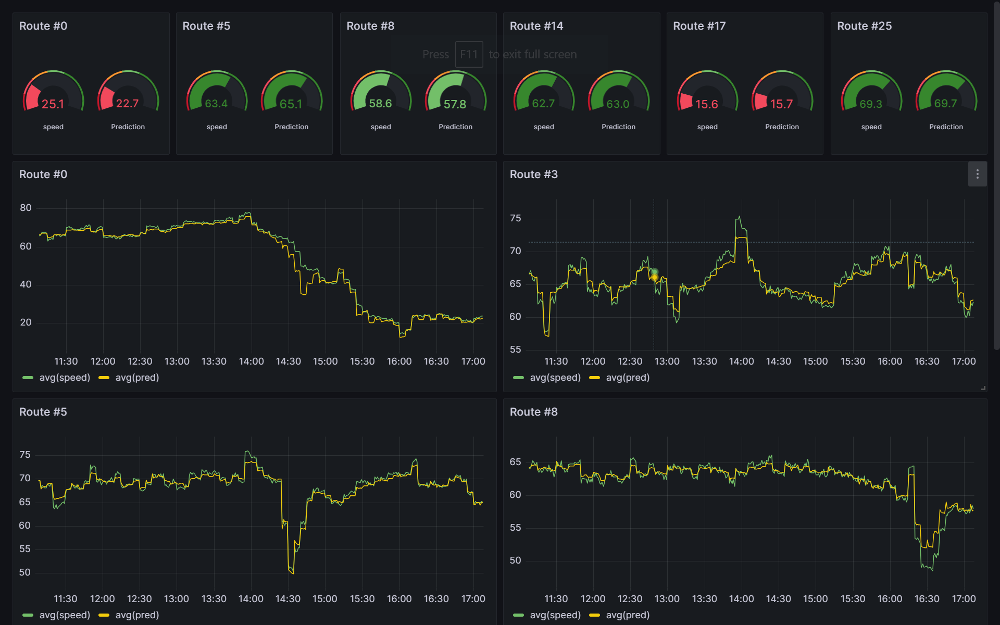

# Demo traffic data analysis

## Pull Docker Images

```bash
docker compose pull
```

## Run the EMQX and TDengine

```bash
mkdir -p taos/{data,log}
docker compose up -d mqtt tdengine
```

## Configure EMQX

- Visit emqx dashboard at localhost:18083
- Login with user name `admin` and `password` public
- Create *data bridge* in *Integration*
  - URL: http://tdengine:6041/influxdb/v1/write?db=traffics
  - Headers:
    - Key: `Authorization`
    - Value: `Basic cm9vdDp0YW9zZGF0YQ==`
  - Body: `velocity,device_id=${payload.device_id} speed=${payload.speed}`
- Create *rules* in *Integration*
  - SQL Editor:
  ``` SQL
  SELECT
    payload
  FROM
    "velocity/#"
  ```

## Run Virtual MQTT Device

```bash
docker compose up -d virtdev
```

## Run GCRNN and Grafana

```bash
docker compose up -d grafana gcrnn
```

## Check Grafana Dashboard

Visit `localhost:3000`, login as user `admin` with password `admin123`. Then find default dashboard `Velocity` in `General` folder.

After running for a while, the dashboard looks like this.


